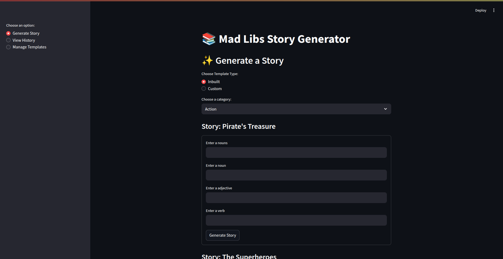
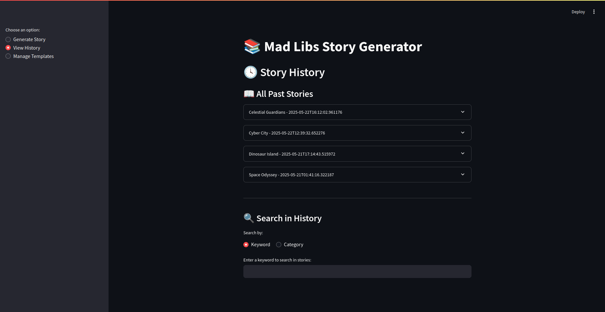
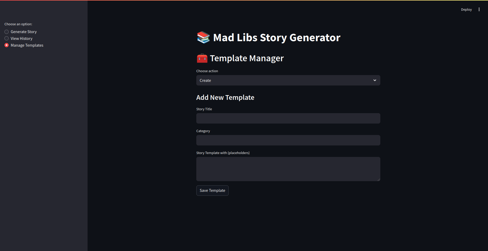

# 🧠 Mad Libs Generator

A fun and interactive **Mad Libs Generator** built with Python and Streamlit. This project allows users to create, manage, and play with story templates that have dynamic placeholders. Users can generate creative and personalized stories, manage their own templates, and view past story history—all through a simple CLI or Streamlit-based web interface.

---

## 📌 Project Description

The **Mad Libs Generator** lets users:
- Choose from random or categorized story templates.
- Fill in prompts like `{noun}`, `{verb}`, etc., to generate a unique story.
- Save story history for future reference.
- Manage (create, update, delete) custom templates.
- Use a clean and intuitive web interface with Streamlit or a CLI alternative.

Perfect for language learners, kids, and creative minds looking for a laugh—or a story twist.

---

## 🚀 Technologies Used

- **Python 3.10+**
- **Streamlit** for the web interface
- **Regular Expressions** for placeholder extraction
- **UUID / Custom ID Generation**
- **JSON** for data storage (templates and history)
- **CLI Support** (Optional)

---

## 🛠 Installation

1. **Clone the Repository**
   ```bash
   git clone https://github.com/your-username/mad-libs-generator.git
   cd mad-libs-generator
   ```

2. **Create a Virtual Environment (optional but recommended)**

   ```bash
   python -m venv venv
   source venv/bin/activate   # or venv\Scripts\activate on Windows
   ```

3. **Install Dependencies**

   ```bash
   pip install -r requirements.txt
   ```

4. **Run the Streamlit App**

   ```bash
   streamlit run app.py
   ```

---

## 📖 Usage

### CLI Option

Run the CLI interface using:

```bash
python cli_main.py
```

You can:

* Create stories
* View and search history
* Manage templates

### Streamlit Web App

Visit: `http://localhost:8501` after running:

```bash
streamlit run app.py
```

Use the sidebar to:

* Generate a story
* View story history
* Manage templates (Create / Update / Delete)

---

## 🌟 Key Features

* 📝 Custom template manager (create, update, delete your own story templates)
* 🔀 Random or categorized story generation
* 🧩 Smart placeholder recognition (`{noun}`, `{verb}`, etc.)
* 🕓 History tracker with search by keyword or category
* 📦 Lightweight JSON-based data storage
* 🖥️ User-friendly Streamlit interface

---

## 🤝 Contribution Guidelines

Contributions are welcome!

1. Fork this repository
2. Create your feature branch (`git checkout -b feature/YourFeature`)
3. Commit your changes (`git commit -m 'Add awesome feature'`)
4. Push to the branch (`git push origin feature/YourFeature`)
5. Open a Pull Request

---

## 🪪 License

This project is licensed under the **MIT License**.

---

## 👤 Author

**Anurag Indora**
📧 Email: `anuragindora474@gmail.com`
🔗 GitHub: [github.com/AnuragIndora](https://github.com/AnuragIndora)

---

## 📸 Screenshots

### 📝 Story Generator  
This section allows users to choose a category, fill in word placeholders (e.g., noun, verb), and generate a creative Mad Libs-style story.



---

### 📖 History Page  
View all previously generated stories, search by keyword or category, and revisit your favorite creations.



---

### 🧰 Template Generator  
Create, view, update, or delete story templates with custom placeholders.



---

## 🙏 Acknowledgments

Special thanks to:

* Python community
* Streamlit developers
* Mad Libs fans worldwide 🌍

---
